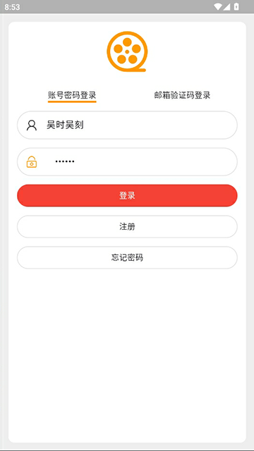
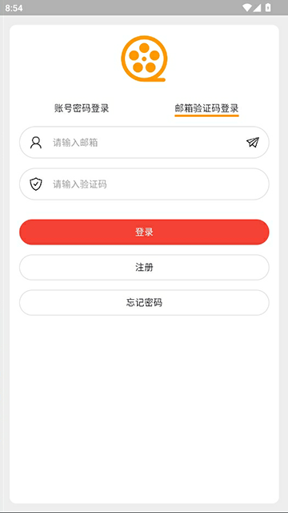
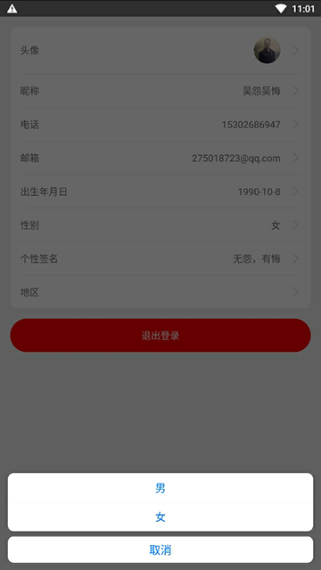
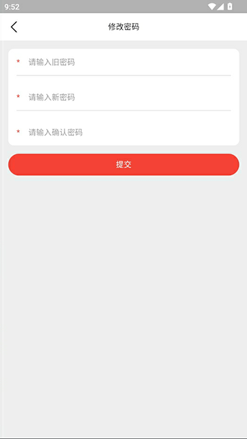
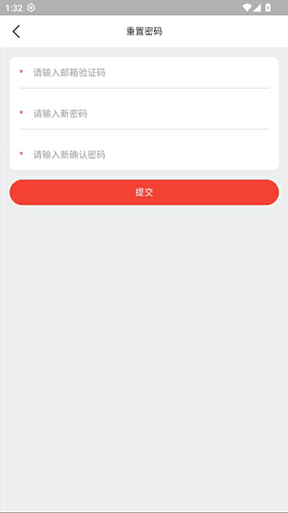
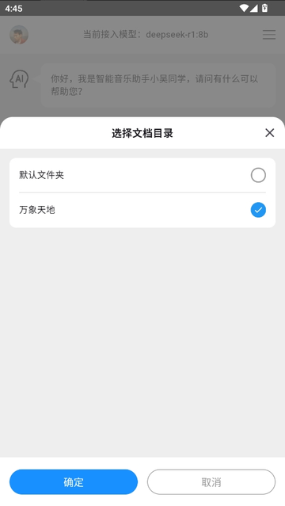
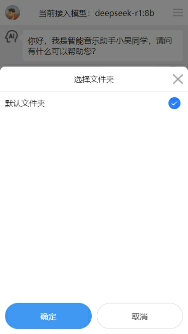
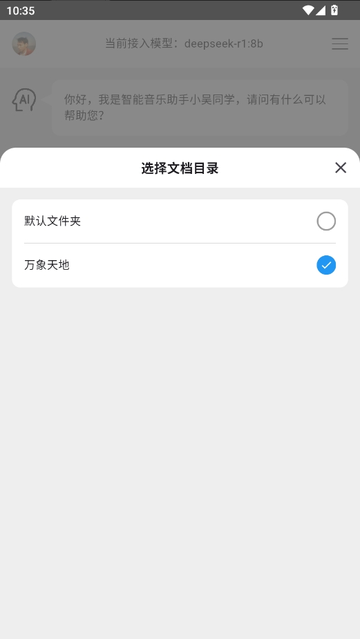

# harmony-arkts-chat-app-ui

开发者：吴怨吴悔

=============================界面预览（如果无法预览，请查看项目根目录png文件）==========================   

=============================界面预览（如果无法预览，请查看项目根目录png文件）==========================

如果打不开github地址，请用github的镜像地址，例如
原地址：https://github.com/wuyuanwuhui999/springboot3-app-service
镜像地址：https://bgithub.xyz/wuyuanwuhui999/springboot3-app-service

后端接口项目和sql语句：   
github springboot2旧项目：https://github.com/wuyuanwuhui99/springboot-app-service （密钥丢失无法登录，该不在更新，迁移到wuyuanwuhui999账号下）  
github springboot3新项目：https://github.com/wuyuanwuhui999/springboot3-app-service    
github fast api版本：https://github.com/wuyuanwuhui999/fast-api-app-service

gitee springboot2旧项目：https://gitee.com/wuyuanwuhui99/springboot-app-service    
gitee springboot3新项目：https://gitee.com/wuyuanwuhui99/springboot3-app-service    
gitee fast api版本：https://gitee.com/wuyuanwuhui99/fast-api-app-service

uniapp ai智能体项目参见
github：https://github.com/wuyuanwuhui999/uniapp-vite-vue3-ts-chat-app-ui
gitee：https://github.com/wuyuanwuhui99/uniapp-vite-vue3-ts-chat-app-ui

flutter ai智能体项目参见
github：https://github.com/wuyuanwuhui999/uniapp-vite-vue3-ts-chat-app-ui
gitee：https://github.com/wuyuanwuhui99/uniapp-vite-vue3-ts-chat-app-ui

flutter电影项目参见:   
github旧地址：https://github.com/wuyuanwuhui99/flutter-movie-app-ui   
github新地址：https://github.com/wuyuanwuhui999/flutter-movie-app-ui   
gitee地址：https://hub.nuaa.cf/wuyuanwuhui99/flutter-movie-app-ui

flutter音乐项目参见:   
github旧地址：https://github.com/wuyuanwuhui99/flutter-music-app-ui   
github新地址：https://github.com/wuyuanwuhui999/flutter-music-app-ui   
gitee地址：https://hub.nuaa.cf/wuyuanwuhui99/flutter-music-app-ui

react native电影参见:   
github地址：https://github.com/wuyuanwuhui99/react-native-app-ui

java安卓原生电影参见：  
通用地址：https://github.com/wuyuanwuhui99/android-java-movie-app-ui   
gitee地址：https://hub.nuaa.cf/wuyuanwuhui99/android-java-movie-app-ui

uniapp电影参见：
github旧地址：https://github.com/wuyuanwuhui99/uniapp-vite-vue3-ts-movie-app-ui   
github新地址：https://github.com/wuyuanwuhui999/uniapp-vite-vue3-ts-movie-app-ui   
gitee地址：https://gitee/wuyuanwuhui99/uniapp-vite-vue3-ts-movie-app-ui

uniapp音乐项目参见：
github旧地址：https://github.com/wuyuanwuhui99/uniapp-vite-vue3-ts-music-app-ui   
github新地址：https://github.com/wuyuanwuhui999/uniapp-vite-vue3-ts-music-app-ui   
gitee地址：https://gitee/wuyuanwuhui99/uniapp-vite-vue3-ts-music-app-ui

微信小程序版本参见：  
通用地址：https://github.com/wuyuanwuhui99/weixin-movie-app-ui、  
国内镜像地址：https://hub.nuaa.cf/wuyuanwuhui99/weixin-movie-app-ui

harmony鸿蒙电影参见:   
github旧地址：https://github.com/wuyuanwuhui99/Harmony_movie_app_ui   
github新地址：https://github.com/wuyuanwuhui999/Harmony_movie_app_ui   
gitee地址：https://hub.nuaa.cf/wuyuanwuhui99/Harmony_movie_app_ui

harmony鸿蒙音乐项目参见:   
github旧地址：https://github.com/wuyuanwuhui99/harmony_music_app_ui   
github新地址：https://github.com/wuyuanwuhui999/harmony_music_app_ui   
gitee地址：https://hub.nuaa.cf/wuyuanwuhui99/harmony_music_app_ui

vue在线音乐项目：  
通用地址：https://github.com/wuyuanwuhui99/vue-music-app-ui   
国内镜像地址：https://hub.nuaa.cf/wuyuanwuhui99/vue-music-app-ui

在线音乐后端项目：  
通用地址：https://github.com/wuyuanwuhui99/koa2-music-app-service   
国内镜像地址：https://hub.nuaa.cf/wuyuanwuhui99/koa2-music-app-service

vue3+ts明日头条项目：  
通用地址：https://github.com/wuyuanwuhui99/vue3-ts-toutiao-app-ui  
国内镜像地址：https://hub.nuaa.cf/wuyuanwuhui99/vue3-ts-toutiao-app-ui

音乐播放器正在开发中，音乐数据来自于python爬虫程序，爬取酷狗音乐数据，敬请关注

接口和数据请在本地电脑中，暂时没有购买和部署服务器，仅限本地调试，如有需要调试请联系本人启动外网映射

本地调试请把 http://192.168.0.5:5001 改成 http://254a2y1767.qicp.vip    
该地址是映射到本人电脑的地址，需要本人电脑开机才能访问，一般在工作日晚上八点半之后或者周末白天会开机   
如需了解是否已开机，请用浏览器直接打开该地址：http://254a2y1767.qicp.vip，如出现以下提示，则正常使用   

本站所有音乐和图片均来自互联网收集而来，版权归原创者所有，本网站只提供web页面服务，并不提供资源存储，也不参与录制、上传 若本站收录的节目无意侵犯了贵司版权，请联系

邮箱：275018723@qq.com
